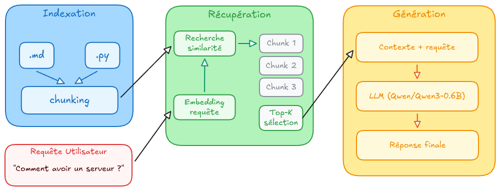

<p align="center">
  
</p>
<h3 align="center">
  <em>"Who controls the past controls the future. Who controls the present controls the past."</em>
</h3>

---

<div align="center">
  <p>
      
      
      
      
  </p>
</div>

## ⚠️ Avant propos

- **Portfolio :** Ce répertoire se concentre sur un seul sujet. Vous pouvez retrouver tous mes projets sur mon [profil](https://github.com/alizealebaron).
- **Sujet :** Conformément aux règles de 42, vous ne trouverez pas le sujet de l'exercice dans ce répertoire.
- **État du projet:** Le code est exactement le même que lorsqu'il a été validé. Il ne sera pas mis à jour même s'il contient des erreurs.
- **Aide & Licence :** Ce répertoire est principalement là pour vous aider à faire votre propre code. Évitez de copier / coller sans comprendre le code.

## 🦆 Status

**Commencé le :** 07/05/2026

**Rendu le :** 14/07/2026

## Description

**Retrieval-Augmented Generation (RAG)** est une approche hybride en intelligence artificielle qui enrichit les modèles de langage en y intégrant des informations externes. En combinant la recherche de données pertinentes avec la génération de texte, le RAG permet de produire des réponses plus précises, actualisées et ancrées dans des sources fiables. Pour ce projet, nous avions comme abjectif de développer pas à pas un système RAG complet.

Les objectifs clés de ce projet sont:

- **Indexation de document**: Apprendre à indexer des documents selons différentes méthodes.
- **Recherche de sources pertinentes**: Reliées des sources pertinente à une question.
- **Répondre à une question donnée**: Générer une réponse selon les sources données.
- **Évaluer les résultats obtenus**: Obtenir un indice de performance fiable de notre RAG.

## Installation

```bash
# Cloner le projet
git clone https://github.com/alizealebaron/RAG_against_the_machine
cd RAG_against_the_machine

# Installation des dépendances
uv sync
# Ou avec le makefile
make install
```

### Commandes du Makefile

```bash
make                   # Installe les dépendances
make index             # Index le répertoire vLLM en utilisant BM25
make search            # Test la recherche sur une question
make answer            # Test la réponse sur une question
make search_dataset    # Recherche pour un dataset entier
make answer_dataset    # Génère des réponses pour un dataset entier
make evaluate          # Calcul le recall@k

make help              # Affiche toutes les commandes disponibles
make lint              # Vérifie les norme mypy et flake8
make clean             # Supprime les caches python
make clean_index       # Supprime les dossier d'index
make clean_output      # Supprime les fichiers générés
make fclean            # clean + clean_index + clean_output
```

## Architecture du système

Ce projet suit un pipeline RAG complet, réparti en 4 étapes principales :

1. Ingestion des sources : le programme parcourt le dépôt local de fichiers vLLM et récupère les documents Markdown et Python.
2. Indexation : chaque fichier est découpé en chunks, enrichi de métadonnées utiles (chemin du fichier, indices de caractères, type de document) et stocké dans un fichier JSON. Un index BM25 est ensuite construit avec la librairie bm25s pour permettre une recherche rapide.
3. Recherche : à partir d'une question, le système tokenize la requête, interroge l'index BM25 et récupère les chunks les plus pertinents.
4. Génération de réponse : les chunks sélectionnés sont fournis à un modèle de langage local via Transformers, qui synthétise une réponse courte et fondée sur le contexte.
5. Évaluation : les résultats de recherche peuvent être comparés à un dataset annoté à l'aide de métriques de recall@k afin d'estimer la qualité du retrieval.

Le point d'entré principal du projet se trouve dans le module CLI, qui expose des commandes simples pour indexer, rechercher, répondre et évaluer.


<p style="text-align:center;">Schéma du fonctionnement de mon RAG</p>

## Stratégie de chunking

Le chunking a été pensé comme un compromis entre qualité de récupération et taille du contexte. Deux stratégies sont utilisées selon le type de fichier :

- Pour les fichiers Markdown, le découpage repose sur les titres et les sauts de ligne. Lorsque la taille d'un bloc devient trop importante, le système coupe le texte tout en conservant un léger overlap pour préserver le contexte entre deux chunks.
- Pour les fichiers Python, le découpage est plus structurel : le projet utilise ASTChunkBuilder pour préserver la logique du code, puis retombe sur un splitter de caractères si un bloc reste trop gros.

Chaque chunk contient également des informations de traçabilité vers le fichier d'origine, ce qui facilite l'explication des réponses et l'évaluation des résultats.

La taille maximale des chunks est configurable, avec une valeur par défaut de 2000 caractères, afin de tester facilement l'impact du découpage sur les performances.

## Méthode de récupération (Search)

La phase de recherche repose sur BM25, un algorithme de ranking robuste pour les systèmes de recherche textuelle. À partir d'une question, le système :

- tokenize la requête,
- charge l'index BM25 préalablement construit,
- récupère les documents/chunks les plus similaires,
- retourne les meilleurs résultats sous forme de structure JSON exploitable pour l'étape de réponse ou d'évaluation.

Le moteur de recherche ne se contente pas de renvoyer des textes bruts : il conserve les métadonnées associées à chaque chunk, ce qui rend les résultats plus interprétables et plus faciles à comparer avec un dataset de référence.

## Analyse de performance

La qualité du pipeline est mesurée à l'aide d'une étape d'évaluation dédiée. Le projet compare les chunks récupérés par le système à ceux attendus dans un dataset annoté à l'aide de métriques de recall@k, notamment recall@1, recall@3, recall@5 et recall@10.

Cette étape permet de répondre à plusieurs questions :

- les chunks sont-ils assez pertinents pour la requête ?
- le découpage est-il adapté au type de document ?
- la taille des chunks influence-t-elle la qualité du retrieval ?

## Choix de conception

Plusieurs choix ont guidé la construction de ce projet :

- **modularité** : le pipeline est séparé en modules distincts pour l'indexation, la recherche, la génération de réponse et l'évaluation.

- **simplicité d'utilisation** : une interface CLI permet d'exécuter rapidement chaque étape sans devoir écrire du code supplémentaire.

- **traçabilité** : chaque chunk garde une trace de son emplacement dans le fichier source.

- **format de sortie structuré** : les résultats sont stockés en JSON pour faciliter l'analyse et la comparaison.

## Défis rencontrés

- Comprendre la globalité d'un RAG et l'articulation entre indexation, recherche et génération.
- Bien chunker ses fichiers sans perdre trop de contexte ni trop de précision.
- Obtenir des réponses correctes et concises à partir d'un petit nombre de sources.
- Optimiser le temps de réponse, notamment lorsque le modèle local est utilisé en inference.

## Exemple d'utilisation

Voici un exemple simple de workflow complet :

```bash
# Indexer les fichiers sources
make index

# Rechercher les chunks les plus pertinents pour une question
uv run python -m student.src search "Comment fonctionne le chunking en Python ?" 10

# Générer une réponse à partir des chunks récupérés
uv run python -m student.src answer "Comment fonctionne le chunking en Python ?" 10

# Évaluer la qualité du retrieval sur un dataset
uv run python -m student.src evaluate path/to/answers.json path/to/dataset.json
```

## Ressources

### Documentations et guides

- [Documention de python fire](https://google.github.io/python-fire/guide/)
- [Guide d'utilisation de tdqm](https://www.datacamp.com/tutorial/tqdm-python)
- [BM25s](https://bm25s.github.io/)
- [Abstract Syntax TreePython](https://medium.com/@dev.aguillin/abstract-syntax-tree-python-85d39a53e86d)
- [Transformers](https://pypi.org/project/transformers/)
- [LangChain Text Splitters](https://reference.langchain.com/python/langchain-text-splitters)

### Index

- [Tout ce que vous devez savoir sur le RAG et ses variantes](https://datascientist.fr/blog/guide-rag-2025-retrieval-augmented-generation?utm_source=begenai.com&utm_campaign=article-webanalyste.com&utm_medium=referral)
- [Qu’est-ce que le RAG Indexing et comment ça marche ?](https://www.begenai.com/quest-ce-que-le-rag-indexing-et-comment-ca-marche/#:~:text=Le%20RAG%20Indexing%20est%20une,recherche%20et%20la%20g%C3%A9n%C3%A9ration%20automatis%C3%A9e.)
- [Chunking : découper vos documents pour le RAG](https://blog.stephane-robert.info/docs/developper/programmation/python/rag-chunking/#:~:text=Strat%C3%A9gie%201%20%3A%20Chunking%20fixe%20(caract%C3%A8res),-Section%20intitul%C3%A9e%20%C2%AB%20Strat%C3%A9gie&text=La%20m%C3%A9thode%20la%20plus%20simple,%22%22D%C3%A9coupage%20fixe%20avec%20overlap.)

- [AST Enables Code RAG Models to Overcome Traditional Chunking Limitations](https://medium.com/@jouryjc0409/ast-enables-code-rag-models-to-overcome-traditional-chunking-limitations-b0bc1e61bdab)
- [cAST: Enhancing Code Retrieval-Augmented Generation with Structural Chunking via Abstract Syntax Tree](https://arxiv.org/html/2506.15655v1)
- [Astchunk](https://github.com/yilinjz/astchunk)

### Search

- [TF-IDF (Term Frequency-Inverse Document Frequency)](https://cuik.io/blog/lexique-seo/tf-idf-term-frequency-inverse-document-frequency/#:~:text=D%C3%A9finition,inverse%20du%20document%20(IDF).)
- [TF*IDF](https://fr.ryte.com/wiki/TF*IDF)
- [Understanding TF-IDF (Term Frequency-Inverse Document Frequency)](https://www.geeksforgeeks.org/machine-learning/understanding-tf-idf-term-frequency-inverse-document-frequency/)

- [Comprendre et implémenter l'algo de score BM25](https://dev.to/pykpyky/comprendre-et-implementer-lalgo-de-score-bm25-47af)
- [What is BM25 (Best Matching 25) Algorithm](https://www.geeksforgeeks.org/nlp/what-is-bm25-best-matching-25-algorithm/)

- [Building Production RAG with Anthropic’s Contextual Retrieval: Complete Python Implementation](https://medium.com/@reliabledataengineering/building-production-rag-with-anthropics-contextual-retrieval-complete-python-implementation-f8a436095860)

### Answer

- [RAG : comment ça marche techniquement ?](https://www.axopen.com/blog/2025/08/comment-fonctionne-un-rag/)
- [How to build your own local IA ?](https://www.freecodecamp.org/news/build-a-local-ai)

### Evaluate

- [RAG Recall vs Precision: A Practical Diagnostic Guide for Reliable Retrieval](https://dev.to/optyxstack/rag-recall-vs-precision-a-practical-diagnostic-guide-for-reliable-retrieval-26oh)
- [RAG en production : sécurité, évaluation, observabilité](https://blog.stephane-robert.info/docs/developper/programmation/python/rag-production/)
- [Retrieval Metrics Tutorial: Recall@k and MRR Explained](https://medium.com/@rajnish_khatri/retrieval-metrics-tutorial-recall-k-and-mrr-explained-d2f12afb9c89)

### Autres RAG

- [RAG de fcaval42](https://github.com/fcaval42/RAG_AgainstTheMachine)
- [RAG de shadox254](https://github.com/shadox254/RAG-against-the-machine)

---

**Dernière modification**: 13 juillet 2026\
**Contact :** alebaron@student.42lehavre.fr
